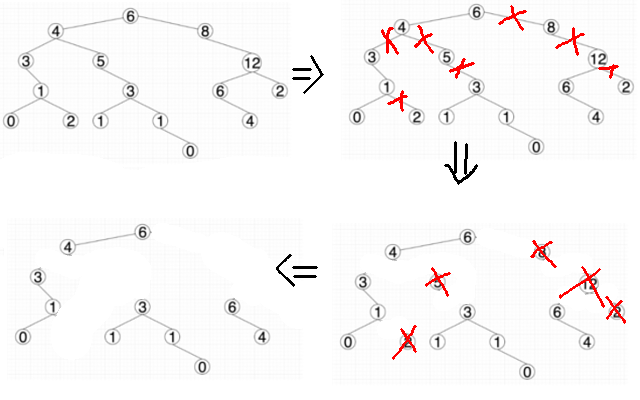
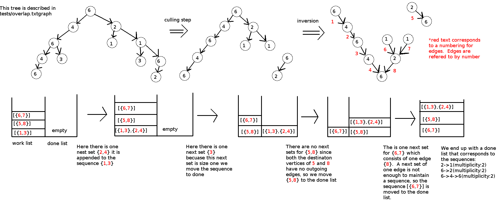
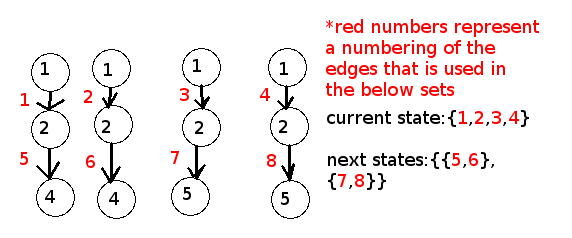

# MagillaCSChallenge
Response to coding Challenge for Magilla (magillaloans.com)

# Build Instructions
To build the program create and navigate to a build directory ```mkdir build && cd build```  
Then run ```cmake .. && make```  
The resulting executable is named ```MagillaCSChallenge```

# Execution Instructions
The first form prints the repeated sequences if the standard graph (from the Google Doc)  
Usage: ```./MagillaCSChallenge```  
Usage: ```./MagillaCSChallenge std [-v]```

The second form reads the file listed as the first agrument and list all the repeated symbols  
Usage: ```./MagillaCSChallenge <.txtgraph file> [-v]```

The option -v causes the program to print out the graph first before printing the repeated sequences

# The txtgraph file format

The each line of the of the .txtgraph file is of the format  
```vertexName(ID) :childVertices```  
Where is vertexName is a name for the vertex you are creating ID is the value of the vertex, and childVertices is a comma delineated list of the names of all the vertices this vertex is adjacent to  
Lines beginning with a # are comments.  Examples can be found under the tests folder.  ```tests/std.txtgraph``` is a .txtgraph representation of the standard tree you sent in the challenge Google Doc.

# Algorithm
In this discussion I will refer to the node's ID as its label.  
Two edges are said to be equivalent if their source and destination vertices have the same labels.  
An edge is unique if there exist no other edges which are equivalent.  
A head node is any node that has no edges incident upon it.  
For the purposes of this discussion an inverted graph is one where all edges x->y are replaced with edges y->x where x and y are vertices in the graph.  

## Motivation behind the Algorithm
After looking at the problem I quickly realized that unique edges can not be part of any repeated sequence so my algorithm first cuts all the unique edges and any deletes any isolated vertices  
  
Doing this (usually) dramatically simplifies the problem.  This is also why I have to store the tree in a graph (rather than a simpler data structure) because the culling step usually creates many disconnected trees  
Another important property of the culled graph is that all head nodes constitute the start of a sequence, and all leaf nodes constitute the end of a sequence.

The "meat and potatos" of my sequence detection algorithm is strongly motivated the subset construction algorithm, which is used by regex compilers.  The central idea behind my duplicate sequence detection algoritm is that at the start of our sequence we will be in an state which is a set of equivalent edges.  Then we will keep moving to other sets of edges that are adjacent to the destination vertex of our edges in the previous state.  This repeats until we no longer have a next state where with at least two edges in it.

This algorithm is complicated by numerous factors, but it turns out that many of them can be solved by inverting the graph.  We will then get the duplicate sequences reversed.  They then can be trivally reversed to be in the correct order.

## Implementation
The algorithm is implemented in the function printOutputSequences() in the file CSChallenge.cpp  
In the implementation we have a workList and a doneList.  The workList stores incomplete sequences and the doneList stores complete sequences.  
We also have a set which stores all the edges that start new sequences or are ruled out for starting new sequences.  
We also have a map which can be used to lookup all sets of equivalent edges by using one of their members as a key.  This is not strictly necessary, but improves the time complexity.  

Below is a trace of the algorithm on the tree represented by the file tests/overlap.txtgraph


After the Graph is culled and inverted the worklist is initialized with incomplete sequences containing a set of edges equivalent to one of the start edges.  
Where the "start edges" are the edges with source vertices that are heads(these vertices were leaves prior to the inversion).


Then, as long as the the workList contains an incomplete sequence the algorithm extracts an element from the worklist and does the following with it:
1. A list of next potential is calculated containing equivalent 
2. If there is one next state of equal size to the current state then the next state is appended to the current sequence and and the current sequence is put back in the work list
3. If there are multiple next states (like in the image below) the sequence is cloned for each next state greater that has more than one edge inside, the edges are appended to the clones and the original sequence is pushed on to the doneList.  

4. In either case if there are more equivalent edges in the graph as a whole than there are in a next state and the next state's edges have not been used as sequence starters already a new sequence is constructed consisting of all the edges equivalent to the edges in next state.

## Complexity
In terms of time complexity I believe the algorithm has a worst case complexity of O(n^2), however it is highly unlikely that the worst case will be realized.  The sequences would have to be densly packed into the tree for this to occur.  
I believe that the algorithm's worst-case space complexity is O(n).  
